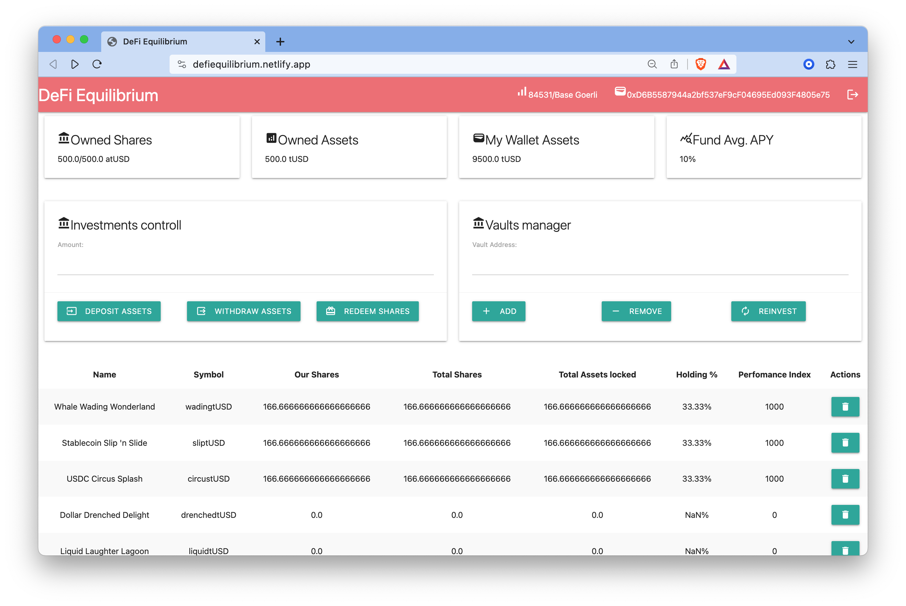

# Description

DeFi AssetsManager focuses on managing a series of yield-bearing vaults. The main idea is to effectively handle and optimize the yield obtained from these vaults.

[LiveDemo](https://defiequilibrium.netlify.app)

[](https://youtu.be/3hHWHVTK5Oo)


## Main Features:

**Vault Management**: Allows the owner to add or remove vaults. Additionally, the contract offers the ability to wrap Beefy Vaults, making them compatible with this system.

**Diversification**: The contract diversifies the investment in the top-performing vaults based on the share price increase. The number of top vaults to invest in can be defined by the diversification parameter.

**Reinvestment Strategy**: The assets are reinvested in top-performing vaults. The strategy involves sorting vaults based on their performance (share price increase) and redistributing the funds accordingly.

**Yield-bearing Tokenization**: The contract tokenizes yield-bearing assets. The name and symbol of the token represent the underlying asset that is being managed.

**Asset Management**: Provides functions like deposit, withdraw, and mint, along with internal logic to manage liquidity between the contract and the vaults to ensure adequate funds when required.

**Utilities**: Comes with utility functions for array manipulation, such as sorting and indexing.

**Inheritance and Integrations**:

- Inherits from OpenZeppelin's Ownable for ownership management.
- Implements the ERC4626 standard with upgradeability.
- Utilizes SafeMath for secure arithmetic operations and other utility contracts from OpenZeppelin.
- Integrates with Beefy's vault system via wrappers.


# Demo



# Development

## Requirements

- [Foundry](https://book.getfoundry.sh/getting-started/installation)

```shell
curl -L https://foundry.paradigm.xyz | bash
source ~/.zshenv
foundryup
```

# Deployment

Create .env or export the following env variables:

```
ETH_WALLET_SEED=
ETH_RPC_URL=
```

and then run

```bash
./bin/deploy.sh
```

# Development

Export env variables

```env
ETH_WALLET_SEED="test test test test test test test test test test test junk"
ETH_WALLET_ADDRESS=0xf39Fd6e51aad88F6F4ce6aB8827279cffFb92266
ETH_RPC_URL=http://localhost:8545
```

Execute anvil test node

```bash
./bin/start-private-node.sh
```

and then deploy smart contract

```bash
./test-deploy.sh
```

set the address of the AssetManager in the .config.json and start webpack dev server

```shell
cd webapp-bootstrap; python3 -m http.server
```

and then `open localhost:8081`

# Problem


# Flow Chart


# ERC-4626

ERC-4626 is a standard to optimize and unify the technical parameters of yield-bearing vaults. It provides a standard API for tokenized yield-bearing vaults that represent shares of a single underlying ERC-20 token. ERC-4626 also outlines an optional extension for tokenized vaults utilizing ERC-20, offering basic functionality for depositing, withdrawing tokens and reading balances.

## Internface

- `function deposit(uint256 assets, address receiver) public returns (uint256 shares)`
This function deposits assets of underlying tokens into the vault and grants ownership of shares to receiver.

- `function mint(uint256 shares, address receiver) public returns (uint256 assets)`
function mint(uint256 shares, address receiver) public returns (uint256 assets)

- `function withdraw(uint256 assets, address receiver, address owner) public returns (uint256 shares)`
This function burns shares from owner and send exactly assets token from the vault to receiver.

- `function redeem(uint256 shares, address receiver, address owner) public returns (uint256 assets)`
This function redeems a specific number of shares from owner and sends assets of underlying token from the vault to receiver.

- `function balanceOf(address owner) public view returns (uint256)`
Returns the total amount of vault shares the owner currently has.

- `_convertToAssets`
```
    function _convertToAssets(uint256 shares, MathUpgradeable.Rounding rounding) internal view virtual returns (uint256) {
        return shares.mulDiv(totalAssets() + 1, totalSupply() + 10 ** _decimalsOffset(), rounding);
    }
```

[ERC4626](https://ethereum.org/en/developers/docs/standards/tokens/erc-4626/)


## Beefy Vault

This is a prototype of the beefy.com Vault contract, it should be used as an interface contract.

```solidity
contract Vault {

// deposit() Executes a transfer of a specified _amount of "want" (i.e. underlying farm token) from the depositor to the vault, and then mints a proportional quantity of mooTokens to the depositor in return.

    function deposit(uint _amount) public nonReentrant {
        strategy.beforeDeposit();
        uint256 _pool = balance();
        want().safeTransferFrom(msg.sender, address(this), _amount);
        earn();
        uint256 _after = balance();
        _amount = _after - _pool; // Additional check for deflationary tokens
        uint256 shares = 0;
        if (totalSupply() == 0) {
            shares = _amount;
        } else {
            shares = (_amount * totalSupply()) / _pool;
        }
        _mint(msg.sender, shares);
    }
    // Executes a burn of a specified _amount of mooTokens from the depositor, and then transfers a proportional quantity of "want" (i.e. underlying farm token) to the depositor in return.

    function withdraw(uint256 _shares) public {
        uint256 r = (balance() * _shares) / totalSupply();
        _burn(msg.sender, _shares);
        uint b = want().balanceOf(address(this));
        if (b < r) {
            uint _withdraw = r - b;
            strategy.withdraw(_withdraw);
            uint _after = want().balanceOf(address(this));
            uint _diff = _after - b;
            if (_diff < _withdraw) {
                r = b + _diff;
            }
        }
        want().safeTransfer(msg.sender, r);
    }

    // Returns the amount of "want" (i.e. underlying farm token) stored in the vault and strategy and yield source as an integer.
    function balance() public view returns (uint) {
        return want().balanceOf(address(this)) + IStrategyV7(strategy).balanceOf();
    }

    // Returns the amount of "want" (i.e. underlying farm token) stored in the vault alone as an integer.
    function available() public view returns (uint256) {
        return want().balanceOf(address(this));
    }

    // Returns the total amount of mooTokens minted as an integer, which are always displayed as 18 decimal token. This is a standard method inherited the ERC-20 standard. Seefor more details.
    function totalSupply() public view virtual override returns (uint256) {
        return _totalSupply;
    }

    // Returns the current price per share of the vault (i.e. per mooToken) as an integer denominated in the "want" (i.e. underlying farm token). This is calculated as Price per Full Share
    function getPricePerFullShare() public view returns (uint256) {
        return totalSupply() == 0 ? 1e18 : balance() * 1e18 / totalSupply();
    }
}
```

## Beefy Interfaces

- [IVault](https://github.com/beefyfinance/beefy-contracts/blob/master/contracts/BIFI/interfaces/beefy/IVault.sol)
- [BeefyWrapper ERC-4226](https://github.com/beefyfinance/beefy-contracts/blob/master/contracts/BIFI/vaults/BeefyWrapper.sol)


## Actors:
- Developer
- Fund Manager
- User

### Fund Manager
- A Fund Manager manage approved beefy.com strategies by adding or removing them.
- To add a strategy vault the Fund Manager calls `AssetManager.addVault(address _vault)`
- To remote the vault `AssetManager.removeVault(address _vault)` has to be called.

### User's flow:
1. When the User wants to invest into the fund, it has to increase allance in the USDC ERC20 smart contract for the AssetManager for the desired amount.
2. Then the User calls `AssetManager.deposit(uint256 _amount)`, that transfer the User's USDC ERC20 tokens to the AssetManager address.
3. The `AssetManager.deposit()`` `_mints()` Fund ERC20 token to the User's address.
5. `AssetManager.deposit()` calls `AssetManager.reinvest()`
6. `Assetmanager.reinvest()` first gets the APY of each `vault` from `approvedVaults` array, finds top  `diversification` perfomers, withdraw funds from other `vaults` and reinvest them to the top perfomers vaults. Then put top performes `vault`s into `activeVaults.`


# Web3 application Specification

Write a Vue.js web3 application using material UI for this project.

It should support Coinbase Wallet and Metamask


## Connect web3 wallet

At top right corner place a Connect button if a web3 wallet is not connected.
When "Connect" button is clicked, wallet has to be connected.
When wallet is connected, an address of the wallet has to be displayed instead of the button.

At the center of the webpage it has to show the following:

## Balance of the Wallet

Connected wallet ERC20 tokens count in the format `${ERC20.balanceOf(walletAddress)} ${ERC20.symbol()}`.
ERC20 contract address has to be received by `AssetManager.want()`

```solidity
function want() public view returns (IERC20Upgradeable) {
    return stableCoin;
}
```

## Deposit
There has to be an input that allows to input the amount of tokens user want's to deposit.
It should have a limit to the `ERC20.balanceOf(walletAddress)`.

Next to the input there has to be the "Deposit" button.
On click the following actions has to be perfomed:

- smart contract call  `ERC20.approve(address walletAddress, uint265 amount)`
- smart contract call  `AssetManager.deposit(uint265 amount)`

These transacitons has to be constructed, singed by the connected web3 wallet and broadcasted to the network.

## Withdraw

There has to be an input that allows to type in the amount of tokens user want's to withdraw.
It should have a limit to the `FundToken.balanceOf(walletAddress)`.

Next to the input there has to be the "Withdraw" button.
On click the following actions has to be perfomed:

- smart contract call `AssetManager.withdraw(uint265 amount)`

These transacitons has to be constructed, singed by the connected web3 wallet and broadcasted to the network.
Show a notification popup when transaction is submited successfully or show error popup if there is error.

## Show addresses of the AssetManager.activeVaults

Show addresses of the current vault in use.
It could be retrieved from the smart contract

`AssetManager.activeVaults`

```solidity
contract AssetManager {
    IVault[] public approvedVaults;
    IVault[] public activeVaults;
}
```

Each activeVault has to be placed in the table.

| Vault Address | Vault Name | Vault APY |
|---------------|------------|-----------|
| 0xABCDEF      | Stargate USDC | 5.11%  |


# Vue

```bash
npm install -g @vue/cli
vue create web3
cd web3
npm install web3 @vue-material/vue-material @vue-material/core
vue add vuetify
```

# References

- [ERC20 Upgradable contract](https://immutablesoft.github.io/ImmutableEcosystem/docs/ERC20Upgradeable.html)
- [vue project creation](https://cli.vuejs.org/guide/installation.html)
- [forge-script contract deployment](https://ethereum-blockchain-developer.com/2022-06-nft-truffle-hardhat-foundry/16-foundry-deployment/)
- [web3.eth.Contract](https://web3js.readthedocs.io/en/v1.2.11/web3-eth-contract.html)
- [An extension on the EIP-20 token that provides basic functionality for depositing and withdrawing tokens and reading balances.](https://eips.ethereum.org/EIPS/eip-4626)
- https://soliditydeveloper.com/erc-4626
- https://www.coinbase.com/cloud/discover/dev-foundations/three-ways-to-integrate-coinbase-wallet

# TODO:

- Check that reinvestment can be executed once in interval
